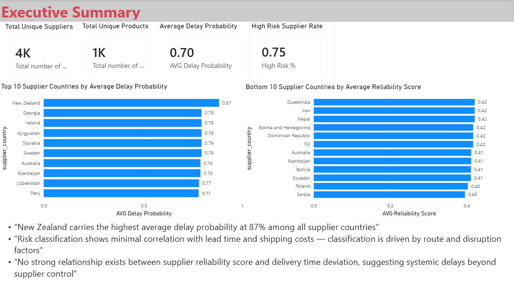
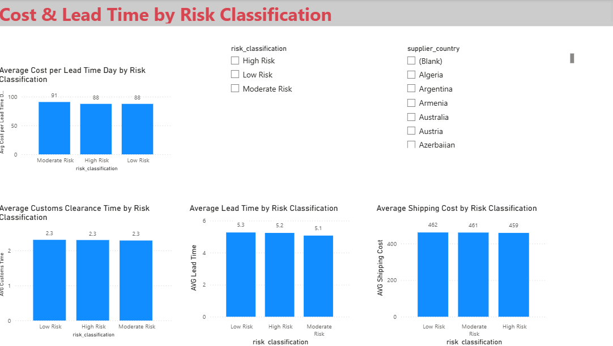
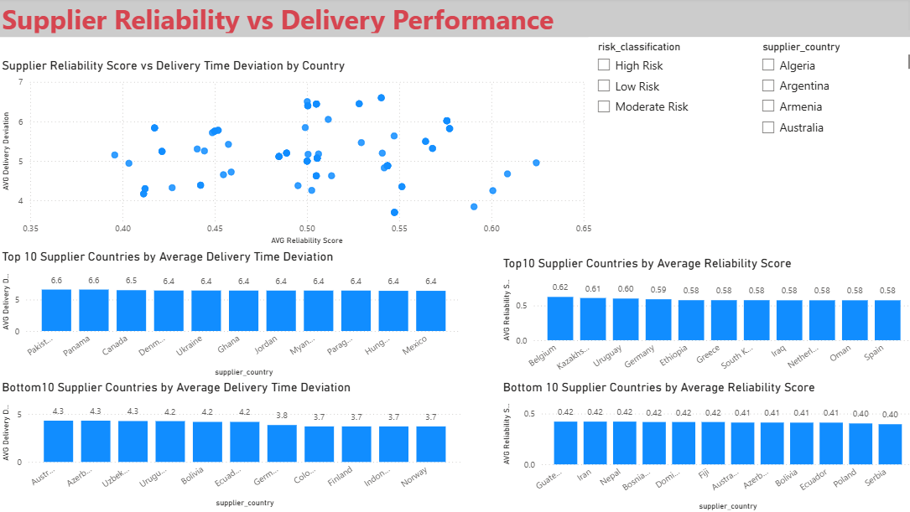

# Supplier Risk & Performance Analytics (Power BI)

## Project Overview
Interactive Power BI dashboard analyzing supplier risk, delivery performance, 
and operational efficiency across 3,500+ suppliers and 94 countries.
Built on a star schema data model with DAX measures to support strategic 
sourcing and procurement decisions.

---

## Business Questions
1. Which supplier countries carry the highest delay and disruption risk?
2. Does risk classification correlate with lead time and shipping costs?
3. Is there a relationship between supplier reliability score and 
   delivery time deviation?

---

## Key Findings
- **New Zealand carries the highest average delay probability at 87%** 
  among all 94 supplier countries
- **Georgia, Ireland, Kyrgyzstan, Slovakia and Sweden lead in disruption 
  score at 0.88** — flagging these as high-priority sourcing risk countries
- **Risk classification shows minimal correlation with lead time and 
  shipping costs** (lead time ranges only 5.1–5.3 days across Low/High/
  Moderate Risk) — classification is driven by route risk and disruption 
  likelihood, not operational delays
- **No strong relationship exists between supplier reliability score and 
  delivery time deviation**, suggesting systemic delays beyond 
  individual supplier control
- **75% of transactions are classified as High Risk**, with an overall 
  average delay probability of 70%
- **Serbia and Poland are the least reliable supplier countries** 
  (reliability score 0.40), while Belgium leads at 0.62

---

## Data Model (Star Schema)

| Table | Key Columns |
|---|---|
| Fact_Supply | supplier_id, product_id, risk_classification, shipping_costs, lead_time_days, delay_probability, disruption_likelihood_score, delivery_time_deviation, supplier_reliability_score |
| Dim_Supplier | supplier_id, supplier_country |
| Dim_Product | product_id |
| Dim_Risk | risk_classification (Low/Moderate/High) |

---

## DAX Measures
```dax
Avg Delay Probability = AVERAGE(Fact_Supply[delay_probability])
Avg Disruption Score = AVERAGE(Fact_Supply[disruption_likelihood_score])
Avg Lead Time = AVERAGE(Fact_Supply[lead_time_days])
Avg Shipping Cost = AVERAGE(Fact_Supply[shipping_costs])
Avg Reliability Score = AVERAGE(Fact_Supply[supplier_reliability_score])
Avg Delivery Deviation = AVERAGE(Fact_Supply[delivery_time_deviation])
Avg Customs Time = AVERAGE(Fact_Supply[customs_clearance_time])
High Risk Transactions = CALCULATE(COUNTROWS(Fact_Supply), 
    Fact_Supply[risk_classification] = "High Risk")
High Risk Transaction % = DIVIDE([High Risk Transactions], 
    COUNTROWS(Fact_Supply))
Avg Cost per Lead Time Day = DIVIDE([Avg Shipping Cost], [Avg Lead Time])
Unreliable Suppliers = CALCULATE(DISTINCTCOUNT(Fact_Supply[supplier_id]), 
    Fact_Supply[supplier_reliability_score] < 0.5)
```

---

## Dashboard Pages

### 1. Executive Summary
Static overview — KPI cards (Total Suppliers, Total Products, 
Avg Delay Probability, High Risk Transaction Rate), top 10 highest-risk 
countries by delay probability, bottom 10 least reliable supplier countries, 
and written key findings.

### 2. Supplier Risk Analysis
Top 10 supplier countries by Avg Delay Probability and Avg Disruption Score. 
Reference table showing both metrics side by side across all countries.
Slicers: Risk Classification, Supplier Country.

### 3. Cost & Lead Time by Risk Classification
Average shipping cost, lead time, customs clearance time, and cost per 
lead time day broken down by risk classification (Low/Moderate/High).
Slicers: Risk Classification, Supplier Country.

### 4. Supplier Reliability vs Delivery Performance
Scatter plot of reliability score vs delivery time deviation. Top and bottom 
10 countries by both reliability score and delivery deviation.
Slicers: Risk Classification, Supplier Country.

---

## Dashboard Preview

### Executive Summary


### Supplier Risk Analysis


### Cost & Lead Time by Risk Classification


### Supplier Reliability vs Delivery Performance


---

## Tools & Technologies
- Power BI Desktop
- Power Query (ETL and star schema design)
- DAX (measures and KPI development)
- Star Schema data modeling
- Microsoft Excel

---

## Repository Contents
- `Supplier_Risk_Analytics_Dashboard.pbix`
- `dynamic_supply_chain_logistics.csv`
- `Summary.png`
- `Supplier_Risk_Analysis.png`
- `Cost_Lead_Time.png`
- `Supplier_Reliability.png`
- `README.md`

---

## Future Improvements
- Predictive risk scoring model using Python/ML
- Supplier segmentation matrix (reliability vs delay risk quadrant)
- Real-time data refresh via Power BI Service
- Drill-through pages by individual supplier

---

## Author
**Mahmoud Sh.**
Supply Chain & Procurement professional with MSc degrees and expertise 
in logistics, sourcing, and supply chain analytics.

LinkedIn: linkedin.com/in/mahmoud-shiri
GitHub: https://github.com/shiri85
